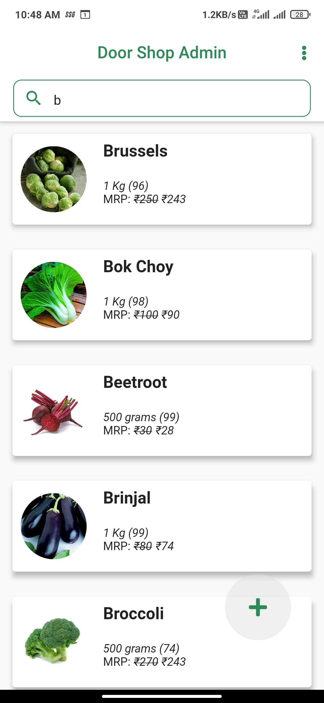

# door_shop_admin

A centralized Flutter application to manage the orders and vegetable listings on the DoorShop app. This is the admin app for the same.
 
 
The app is internet aware, additional checks placed interacting with the firebase. The app asks permission while accessing the storage for the vegetable pics.
 
 

 
 

## Login screen
---
 

 
 
 
 
 
 
 
 
 
 
 
 
 
 
 
 
 
 
 
 
 
 
 
 
 

Animated typewriting text for the heading and a background image. Login form, authenticating the user from the firebase.

 
 

## Home
---
 

 
 
 
 
 
 
 
 
 
 
 
 
 
 
 
 
 
 
 
 
 
 
 
 
 

Home page, consisting the list of vegetables, search option for faster selection, and popup menu. The popup menu contains all the orders, and logout. Clicking on the vegetable takes you to the updattion form for the crop, and the floating addition button takes you to the addition form to add vegetables to the list.

 
 

## Search
---
 

 
 
 
 
 
 
 
 
 
 
 
 
 
 
 
 
 
 
 
 
 
 
 
 
 

Search functionality for finding the exact thing what the admin is looking for.

 
 

## Addition
---
 

 
 
 
 
 
 
 
 
 
 
 
 
 
 
 
 
 
 
 
 
 
 
 
 
 

Addition form to add new vegetables. This requires permission to access the storage for the crop/vegetable image

 
 

## Updation
---
 

 
 
 
 
 
 
 
 
 
 
 
 
 
 
 
 
 
 
 
 
 
 
 
 
 

Updation form enables for easy updation of the available quantity, discount, price, image, units, and name

 
 

## Orders
---
 

 
 
 
 
 
 
 
 
 
 
 
 
 
 
 
 
 
 
 
 
 
 
 
 
 

The orders page lists all the orders placed by any customer on DoorShop app and their status. On tapping the order, you can see the detailed summary of that order.

 
 

## Order Summary
---
 

 
 
 
 
 
 
 
 
 
 
 
 
 
 
 
 
 
 
 
 
 
 
 
 
 

The order summary contains the detailed information about that order, cutomer info, order date, odering address, list of items, billing amount, and status. Additionally, out for delivery status shows arriving today message and the delivered status mentions the delivery date. Once the order is ready for next step, the button on the lower app bar can easily update the order status with just one click.

 
 
